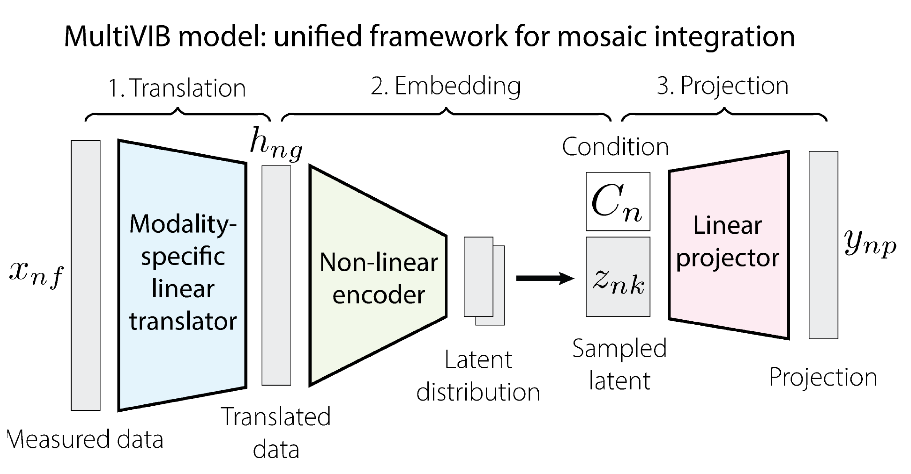
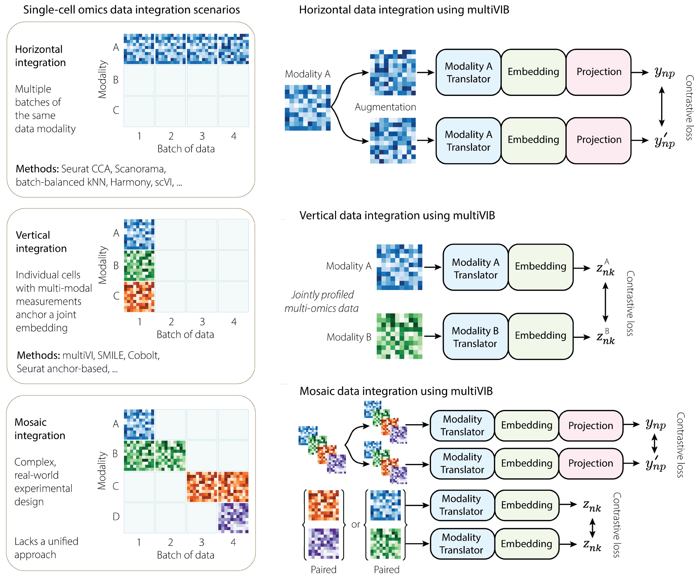

# multiVIB

<div align="center">

**A Unified Probabilistic Contrastive Learning Framework for Atlas-Scale Integration of Single-Cell Multi-Omics Data**

[](https://www.python.org/downloads/)
[](https://pytorch.org/)
[](LICENSE)
[](https://www.biorxiv.org/content/10.1101/2025.11.29.691308v1.full)

</div>

---

## Overview

Single-cell atlases must scale across platforms, species, and modalities — but existing tools typically address only narrow integration scenarios, forcing ad hoc workflows that introduce artifacts.

**multiVIB** solves this with a single unified architecture that adapts to any integration task by changing only the *training strategy*, not the model itself.

<div align="center">

</div>

The backbone consists of three shared components:
1. **Modality-specific linear translator** — maps each modality into a shared feature space
2. **Shared variational encoder** — learns a common latent representation
3. **Shared projector** — maps latents to a contrastive embedding space

<div align="center">

</div>

### Integration Scenarios

| Scenario | Data | Strategy |
|---|---|---|
| **Vertical** | Jointly-profiled multi-omics cells | Paired anchors guide cross-modality alignment |
| **Horizontal** | Modality-separated datasets | Shared features + OOD alignment without paired cells |
| **Mosaic** | Mixed paired/unpaired | Combines both strategies adaptively |
| **Cross-species** | Multiple species/platforms | Per-species translators with shared encoder |

---

## Installation

We recommend creating a fresh conda environment:

```bash
conda create -n multivib python=3.10
conda activate multivib
```

Install from source:

```bash
git clone https://github.com/broadinstitute/multiVIB.git
cd multiVIB
pip install .
```

Install with development dependencies (for testing):

```bash
pip install ".[dev]"
```

---

## Quick Start

```python
import numpy as np
import multivib

# --- Build a bi-modal model (e.g. RNA + ATAC) ---
model = multivib.multivib(
    n_input_a=2000,   # RNA genes
    n_input_b=35000,  # ATAC peaks
    n_hidden=256,
    n_latent=20,
    n_batch=3,        # number of batch covariates
)

# --- Vertical integration (paired + unpaired cells) ---
loss = multivib.multivib_vertical_training(
    model,
    Xa=rna_unpaired,     Xb=atac_unpaired,
    Xa_pair=rna_paired,  Xb_pair=atac_paired,
    batcha=batch_rna,    batchb=batch_atac,
    batcha_pair=batch_rna_pair, batchb_pair=batch_atac_pair,
    epoch=100, batch_size=256,
)

# --- Encode cells ---
import torch
model.eval()
with torch.no_grad():
    out = model(
        torch.tensor(rna_unpaired).float(),
        torch.tensor(atac_unpaired).float(),
        torch.tensor(batch_rna).float(),
        torch.tensor(batch_atac).float(),
    )
latent = out["z_a"].numpy()   # shape (n_cells, n_latent)
```

---

## Package Structure

```
multivib/
├── __init__.py      Public API
├── layers.py        Neural network building blocks
│                      MaskedLinear, LoRALinear,
│                      VariationalEncoder, CellTypeClassifier
├── losses.py        Loss functions & regularisers
│                      DCL, OODAlignmentLoss, GraphNeighborhoodReg, VICRegLoss
├── models.py        Model backbones
│                      multivib, multivibLoRA,
│                      multivibS, multivibLoRAS, multivibR
├── training.py      Training loops
│                      multivib_vertical_training
│                      multivib_horizontal_training
│                      multivib_species_training
│                      multivibR_training
└── utils.py         Helper functions
                       crossover_augmentation, scale_by_batch, one_hot
```

---

## Models

### Bi-modal models

| Model | Translator | Best for |
|---|---|---|
| `multivib` | MaskedLinear (supports biological priors) | RNA ↔ ATAC with gene-peak links |
| `multivibLoRA` | Low-rank adapter | High-dimensional modalities (e.g. Hi-C) |

### Multi-species / mosaic models

| Model | Translator | Best for |
|---|---|---|
| `multivibS` | Per-species MaskedLinear | Cross-species with shared orthologs |
| `multivibLoRAS` | Shared B + per-species A | Very many species or cell atlases |
| `multivibR` | — (single modality) | Reference atlas building from RNA only |

---

## Tutorials

End-to-end Jupyter notebooks are provided in [`doc/tutorial/`](doc/tutorial/):

| Notebook | Description |
|---|---|
| [01_vertical_integration_test.ipynb](doc/tutorial/01_vertical_integration_test.ipynb) | Conceptual experiment from Figure 2 of the manuscript |
| [02_multimodal_integration.ipynb](doc/tutorial/02_multimodal_integration.ipynb) | RNA + ATAC integration of mouse cortex datasets |
| [03_cross_species_integration.ipynb](doc/tutorial/03_cross_species_integration.ipynb) | Cross-species integration of mammalian basal ganglia |

---

## Running Tests

```bash
pip install ".[dev]"
pytest tests/ -v
```

---

## Citation

If you use multiVIB in your research, please cite:

```bibtex
@article{xu2025multivib,
  title   = {multiVIB: A Unified Probabilistic Contrastive Learning Framework
             for Atlas-Scale Integration of Single-Cell Multi-Omics Data},
  author  = {Yang Xu and Stephen Jordan Fleming and Brice Wang and
             Erin G Schoenbeck and Mehrtash Babadi and Bing-Xing Huo},
  journal = {bioRxiv},
  year    = {2025},
  doi     = {10.1101/2025.11.29.691308}
}
```

---

## License

BSD 3-Clause License — see [LICENSE](LICENSE) for details.
